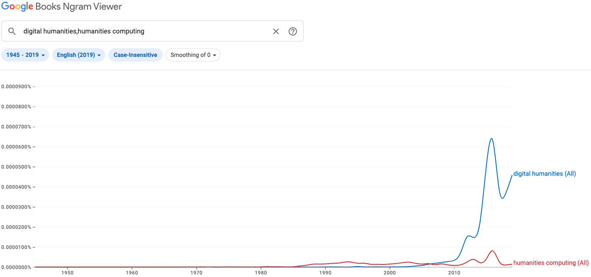

# Introduction

WHat's digital in Digital Humanities? The answer should be obvious, but:

- digital
- humanities
- Digital Humanities

have no easy definition, all the more that there are variations from one country to the other. We could also add that their history, their temporality -- from a centuries old word (Humanities) to an expression coined around 2004 for Digital Humanities -- are quite different. 

- digital => latin => fingers, by extension numbers under 10 (counting on fingers) and starting around 1945: what is related to computer, opposed to analog
- humanities => humanity => human => latin

Two words from latin, but with meanings that are older for humanities, with strong traditions, and more recent with 'digital', and a tradition that is being built, in way. That's what's digital humanities is trying to confront. 

Questioninig the digitality of Digital Humanities is questioning those definitions and temporalities and how they are confronting within the term "digital humanities".

The aim of this chapter proposal is to evaluate the *digitality* of digital humanities. In *The Archived Web*, Niels Brügger notes that many publications about "digital and X" (p. XX) have been published, without much reflection on what *digital* means. If we stand from a particular use of electricity that is at the center of the binary system that is a computer, *digital* means the use of '0' (no electricity) and '1' (electricity) as an alphabet (Finneman, quoted by Brügger). The problem of such a definition of *digital* is that 0/1 are to be seen as building blocks. Let's then follow Brügger:

>  In the present context, the term digitality is used to capture the specific ways in which the digital bits are materialized and combined in a concrete media artifact and in concrete texts.

So, what's the digitality of Digital Humanities? In other words, what's *digital* in the *digital* humanities?

The answer to this question depends on *how* Digital Humanities can be defined. And this *how* is far from easy. Based on a database made of *Day of DH* quotes, Jason Heppler created the website *What is Digital Humanities* that relies on 817 different definitions of DH.

Def. companion:

> Especially since the 1990s, with the advent of the World Wide Web, digital humanities has broadened its reach, yet it has remained in touch with the goals that have animated it from the outset: using information technology to illuminate the human record, and bringing an understanding of the human record to bear on the development and use of information technology. (http://digitalhumanities.org:3030/companion/view?docId=blackwell/9781405103213/9781405103213.xml&chunk.id=ss1-1-3&toc.depth=1&toc.id=ss1-1-3&brand=9781405103213_brand)


Origines du terme:

- Companion, en 2004
- première conférence: Sorbonne, 2006

Quelle différence avec Humanities computing? Quelle définition de base des DH? Selon définition, les Annales faisaient déjà des DH.


# The History of Digital Humanities as a myth

## Roberto Busa, first digital humanist?

Was Roberto Busa digital? What's the digitality of the index tomiscus?
digital => finger => manual work => Busa

## A counter-history of Digital Humanities?

What's the digitality of the school of the Annales?


On complète par Svensson: Landscape, etc DHQ:


# The Great Rename: when Humanities Computing became Digital Humanities

<iframe name="ngram_chart" src="https://books.google.com/ngrams/interactive_chart?content=digital+humanities,humanities+computing&year_start=1945&year_end=2019&case_insensitive=on&corpus=en-2019&smoothing=0" width=900 height=500 marginwidth=0 marginheight=0 hspace=0 vspace=0 frameborder=0 scrolling=no></iframe>



```{python, message=FALSE, echo=FALSE}
import pandas as pd
import matplotlib.pyplot as plt

# Read the csv file
df = pd.read_csv('data/gtrends_dh-hc.csv')

# Convert the 'Months' column to datetime
df['Months'] = pd.to_datetime(df['Months'])

# Sort values by date
df = df.sort_values('Months')

# Plotting
plt.figure(figsize=(12,6))
plt.plot(df['Months'], df['digital humanities'], label='digital humanities', color='blue')
plt.plot(df['Months'], df['humanities computing'], label='humanities computing', color='red')
plt.xlabel('Months')
plt.ylabel('Number')
plt.title('Digital Humanities and Humanities Computing Trends Over Time')
plt.legend(loc='best')

plt.show()

```


# Digital Humanities beyond digitality

manifesto todd presner
=> il y a quelque chose à mettre ici: DH comme communauté, DH comme se voyant 'fer de lance' des sciences humaines et sociales -> là, on est au-delà du numérique.

manifesto Paris 
=> interdisciplinarity

- importancce of practices
  - THATCamp 2009 => debate on Digital Humanities / Humanities relationships
  - 
- importance of debate
- question of diversity
- 

# Conclusion: digital humanities as a part of the digital culture

On passe à la notion de numérique comme 'culture' (Doueihi) -> notion de numérique comme culture sort du numérique stricto sensu, et donne une meilleure idée de ce que sont les humanités numériques.

In fine humanités numériques caractérisées par des éléments non-numériques se fondant sur la rencontre entre l'ordinateur et les sciences humaines.


À lire: 
- Debates in the digital humanities (2012, )