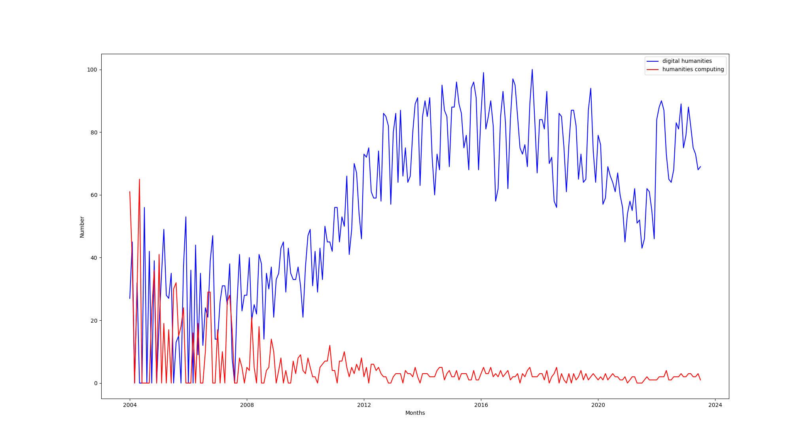

# Introduction

<!-- 
   
That sounds like a lot to attempt in a short article, so you may find as you go that the scope shrinks. The core thing that I am hoping to get from the viewpoint of the book would be a discussion of , so questions such as
 
- Why was this term adopted over alternatives?
- What was it seen to mean at the time it was adopted?
- How has that meaning been contested, evolved, etc? Did the digital in digital humanities mean different things to different communities?
- Why, in all the debates about what DH is, who qualifies as a digital humanist, etc. has there been so little attention paid to trying to define or historicize digitality?
 
What you talk about in the first and second parts is relevant to this, in as much as it’s about digitality vs. humanities computing. To the extent that there’s been a huge effort to memorialize Busa, who obviously didn’t call himself a digital humanist, it emphasizes that this is just a rebranding of “humanities computing” (as well as broader points about constructing a mythical history).
 
So there’s an interesting dual history there: on the one hand digital humanities was invented as an identity circa 2001. (See Kirschebaum’s https://dhdebates.gc.cuny.edu/read/untitled-88c11800-9446-469b-a3be-3fdb36bfbd1e/section/f5640d43-b8eb-4d49-bc4b-eb31a16f3d06 which sems a useful starting point for this). On the other hand it goes back to the 1950s.
 
If I understand what you are saying for the second part, that might be asking why quantitative and statistical approaches to history haven’t been considered part of DH. Which is a reasonable question given that digitality is literally about digits. That also seems to tie in with the extent to which DH was just a rebranding of humanities computing, and also the extent to which its agenda was set by English Lit scholars rather than historians (as mentioned in the article linked above).
 
The idea of DH as a community and culture, which you mention for part 3, is also relevant in as much as the community has an implicit operational definition of what the digital in DH means that’s powerful, even if it’s been reluctant to engage explicitly with the concept or history of digitality.
 
Overall, then, I think the all topics you mention could be part of a chapter that would fit in the book, but I think you need some anchoring material there talking about what DH was taken to mean by the people who adopted it, as well as talking about how they mythologized a past to support this self-conception and about what that invented past leaves out. That doesn’t mean trying to invent your own analytical definition of what DH should be, just taking about what the “digital” in DH meant to the people who adopted it.
-->

<!--

Multilayered digitality within a western environment (peer review, etc). Quelques remises en cause: THATCamp, blogging, social media).

-->

Fifteen years ago, the author of this chapter was participating to a digital humanities “unconference”[^thatcamp]: among the many topics discussed, the participants wondered if 'analog' and 'digital' humanities would one day converge. One answer came out: it would not be possible to see both converge without traditional humanities adopting digital humanities' practices (and for instance unconferences, openness -- open access, open data and so on -- etc.) Those practices were not all digital *per se* -- some were induced by the use of digital tools (here: digital computers and pieces of software running on it), but others seem more to be a question of diverging cultures. Wikis, for instance, did not invent collaboration. After all, digital humanities did not only relate to Humanities and computing -- there was something more, linked to what could be called culture.

[^thatcamp]: That happened during THATCamp 2009. For a definition of what were THATCamps, please go to the now archived website: https://thatcamp.org/about/index.html. The anecdote here dates back to [THATCamp CHNM 2009](https://chnm2009.thatcamp.org/). One blog post discussing that can be read here: https://chnm2009.thatcamp.org/06/25/us-vs-them/index.html. The anecdote is narrated as it happened according to the author's memory -- it might have happened otherwise. 

What's digital in Digital Humanities? The answer seems obvious, but the previous anecdote shows that it is not, that it could relate to some sort of cultural habits or values as Lisa Spiro argued (@spiroThisWhyWe2012a) and not only to something "digital" *per se*. The two words and the expression they are combined into bear ambiguities and ambivalences. Both coming from latin, but none of them having an easy definition nor a stable one through their history, all the more that there are variations from one country to the other. The change of meaning of "digital" -- related to fingers and by extension numbers under 10 -- after 1945, when it became  related to computer opposed to analog technologies, is opposed in a way to 'Humanities', that relates to strong academic and educational Western traditions. That's what's digital humanities is trying to confront: centuries old traditions and a group of few decades old ones.

Questioninig the digitality of Digital Humanities is questioning those definitions and temporalities and how they are confronting within the term "digital humanities". In *The Archived Web* (@bruggerArchivedWebDoing2018 Chapter 2, “The Digital and the Web”), Niels Brügger notes that many publications about "digital and X" (p. XX) have been published, without much reflection on what *digital* means. If we stand from a particular use of electricity that is at the center of the binary system that is a computer, *digital* means the use of '0' (no electricity) and '1' (electricity) as an alphabet (Finnemann, quoted by Brügger[^finnemann]). The problem of such a definition of *digital* is that 0/1 are to be seen as building blocks. Let's then follow Brügger:

[^finnemann]: Finnemann,	N.	O.	(1999).	Modernity	modernised:	The	cultural	impact	of computerisation.	In	P.	A.	Mayer	(Ed.),	Computer,	media	and	communication (pp.	141–159).	Oxford:	Oxford	University	Press.

>  In the present context, the term digitality is used to capture the specific ways in which the digital bits are materialized and combined in a concrete media artifact and in concrete texts.

So, what's the digitality of Digital Humanities? How did (still do) Digital Humanities set up specific ways to transform digital bits, to materialize them into concrete artefacts, and maybe more cultural ones, which i part of Milad Doueihi's argumentation (see @doueihiPourHumanismeNumerique2012). There are canonical definitions of Digital Humanities, the oldest one being in *A Companion to Digital Humanities* (2004)

> Especially since the 1990s, with the advent of the World Wide Web, digital humanities has broadened its reach, yet it has remained in touch with the goals that have animated it from the outset: using information technology to illuminate the human record, and bringing an understanding of the human record to bear on the development and use of information technology. [(@schreibmanCompanionDigitalHumanities2004)](http://digitalhumanities.org:3030/companion/view?docId=blackwell/9781405103213/9781405103213.xml&chunk.id=ss1-1-3&toc.depth=1&toc.id=ss1-1-3&brand=9781405103213_brand).

This definition -- that also describes the transition from Humanities computing to Digital Humanities -- describes a sort of return ticket of the Humanities to information technologies. But this return-ticket does not say much, in the end, of the digitality in the digital humanities, as it sends the definition of 'digital' to information technologies, which might explain the numerous definition of DH that can be found online.

For instance, based on a database made of *Day of DH* quotes - a yearly event mobilising quite broadly the DH community --, Jason Heppler created the website [*What is Digital Humanities*](https://whatisdigitalhumanities.com) that relies on around 800 different definitions of DH.

 application)](img/Figure_1.png)

The Figure 1 is a distant reading (a quantitative approach) of those almost 800 quotes that looks for a definition of digital humanities: and there is obvisouly not much about 'digital' *per se*¨. Where are 0s and 1s? What digitality means to Digital Humanities? In the end, the diverse definitions of Digital Humanities do not answer this question. Might the collective memory of the DH community provide an answer?

# DH collective memory and digitality

By "history", here, we do not mean an academic "history" of DH[^historyofdh], but as a sort of collective memory (@halbwachsCadresSociauxMemoire1994) that would be socially shared by the members of the DH community. 

[^historyofdh]: For that, numerous research, rather recent, do exist: @sulaEarlyHistoryDigital2019, or @nyhanUncoveringHiddenContributions to give but a few examples.

<!-- The first part would start by analysing how DH have been writing their own history, building a myth (ie Roberto Busa), a myth is questioned since 2010-2012. -->

The usual narration of Digital Humanities history starts with a meeting between Roberto Busa, a Jesuit, and his project of indexing Thomas Aquinas' full work, with IBM chairman, Thomas J. Watson, in 1946. As Roberto Busa passed away in 2011 at 97, most generations of researchers in Humanities computing and, then, Digital Humanities could still read his foreword to *A Companion to Digital Humanities* @busaForewordPerspectivesDigital2004.

Busa's project, the *Index Thomisticus*, indexed, in the end, more than 10 millions words, in 56 volumes. The first of them was published in 1974 and the publication of all volumes was completed in 1980. In the end, the *Index Thomisticus* was a *digital* project -- in the sense that it used *digital* machines that were mainframes -- with paper (it began using punchcards) or analog (tapes) inputs  and paper outputs (books). The project was then transformed into CD-ROM (1992) and into a website (2005). A project thought initially on paper, the *Index*  bears analog as well as digital caracteristics, influenced numerous other projects, but also bears some aspects of a myth: a key person (Roberto Busa), an influence over several generations, the insistance on text and on ways to transform text into something that can be computed and structured (lemmatization, concordances, etc).

Other usual steps of a traditional history of Digital Humanities include the creation of two associations - the Association for Literary and Linguistic Computing (ALLC) in 1973 (today, the European Association for Digital Humanities) and the Association for Computer in the Humanities (1978), the former more european and the latter being more north-american. Starting in 1988, the two associations organised a conjoint annual conference. With the Association for Computational Linguistics, both created the Text Encoding Initiative (TEI) consortium -- a major actor in Humanities computing and today in Digital Humanities that shows how Humanities Computing were rooted into the study of text. The TEI has as a main mission to encourage *via* a common markup language the encoding and semanticization of the digital version of texts. The strong influence of computational linguistics but also of English departments (@kirschenbaumChapterWhatDigital2012) is often emphasized to explain this part of DH history. In itself, the work within and between associations is a rather classical academic one. A more digital step if this history is the creation of the [*Humanist* Discussion Group](https://www.dhhumanist.org/) -- *Humanist* and not *Digital Humanist* nor *Conmputatinal Humanist* nor... -- by [Willard McCarthy](https://www.mccarty.org.uk/), that still serves today as a pivotal place to debate DH. 

Around 2004, the switch from Humanities Computing to Digital humanities started. The first step of this switch was the publication of the *Blackwell Companion to Digital Humanities*, edited by Susan Schreibman, Ray Siemens and John Unsworth. The three editors, in their introduction, present the book as a turning point in Digital Humanities as “for the first time, a wide range of theorists and practitioners, those who have been active in the field for decades, and those recently involved, disciplinary experts, computer scientists, and library and information studies specialists, have been brought together to consider digital humanities as a discipline in its own right, as well as to reflect on how it relates to areas of traditional humanities scholarship.” (@schreibmanDigitalHumanitiesHumanities2004) and then pay an hommage to the work of Roberto Busa, who wrote the book's foreword (@busaForewordPerspectivesDigital2004). Observing that the field has expanded, the authors hence suggest a sort of definition of digital humanities, that we riscussed sooner in this chapter. Later in this introduction, a short mention of Humanities Computing defines it as the “interdisciplinary core" of Digital Humanities.

The publication of the *Companion* seemed to pave the way to a further institutionalization of Digital Huanities with the creation of the Association of Digital Humanities Organization (2005), an association regrouping DH associations, and being the main organizer of the regular series of Deigital Humanities conference, based on the former joint conferences of ACH and ALLC. This first annual DH conference was organized in Paris, in the walls of the good old Sorbonne. Its website is not available anymore, but as an [archive](https://web.archive.org/web/20060705200829/http://www.allc-ach2006.colloques.paris-sorbonne.fr/)[^dh2006].

[^dh2006]: [https://web.archive.org/web/20060705200829/http://www.allc-ach2006.colloques.paris-sorbonne.fr/](https://web.archive.org/web/20060705200829/http://www.allc-ach2006.colloques.paris-sorbonne.fr/)

The switch from Humanities Computing to Digital Humanities is quite obvious when we look at Google Trends, that reflects search queries with Google Search (Figure 2).

<!-- code does not work anymore within the article
{python, message=FALSE, echo=FALSE}
import pandas as pd
import matplotlib.pyplot as plt

# Read the csv file
df = pd.read_csv('data/gtrends_dh-hc.csv')

# Convert the 'Months' column to datetime
df['Months'] = pd.to_datetime(df['Months'])

# Sort values by date
df = df.sort_values('Months')

# Plotting
plt.figure(figsize=(12,6))
plt.plot(df['Months'], df['digital humanities'], label='digital humanities', color='blue')
plt.plot(df['Months'], df['humanities computing'], label='humanities computing', color='red')
plt.xlabel('Months')
plt.ylabel('Number')
# plt.title('Digital Humanities and Humanities Computing Trends Over Time')
plt.legend(loc='best')

plt.show()

```
--> 



There are several possible interpretations about the switch from Humanities Computing to Digital Humanities and the changes in institutionalization that followed. The immediate origins of the *Companion* is one: the term *Digital Humanities* came up during exchanges between the editors and their publishers at Blackwell. In a way, it was a sort of rebranding: using an expression that seemed to be easily understandable (though -- hence? -- not that well defined), so that the book could reach a large audience. The introductory text of the *Companion* and other researchers (myself included) insisted on the long-term effects of the rise of the World Wide Web -- the editors of the Companion are emphasizing “human record” and the digitization of the “human record” obviously found in the web a way of dissemination. Here, the crossing of datafication and networkization could be seen as one of the grounding stone of Digital Humanities. This rise of Digital Humanities -- whether because of a rebranding or of the advent of the web -- also gave birth to new digital practices in the Humanities: the switch to Digital Humanities corresponds also to a rise of the number of newcommers (like myself in 2008) : not only did 'digital humanities' replace 'humanities computing', but the 'digital humanities' seem to be more popular too.

In 2011, Roberto Busa, who wrote the foreword of the *Companion* (without using the expression *digital humanities*), passed away. A number of blogposts payed an hommage to his work, for instance on Stephen Ramsay's blog (@ramsayFrRobertoBusa2011). If Ramsay admits that Busa was part of a wider intellectual field, he claims his importance and influence in Digital Humanities: “Perhaps the New Criticism was taking hold in some other part of the world, but for Busa, philology was the proper hermeneutical framework.” -- founding Digital Humanities in the old European tradition, pre-1945. Humanities Computing is hence described as founded on both computers and old (european) traditions, cautionning in advance later criticism of Digital Humanities (@allingtonNeoliberalToolsArchives2016).

If we can admit that Busa was part of a wider intellectual field, why did his name became that central in Digital Humanities? Stephen Ramsay, quoting John Unsworth, seems to give the answer: “Most disciplines can’t point to a founding moment, much less a divine one.”

<!-- à développer -->

# A counter-history of Digital Humanities? The example of the Annales School

As Ramsay wrote in 2011, “Busa was one among the many who were striving to bring computer technology — then in its early infancy — to bear on humanistic problems back in the forties. Like most dh scholars today, he was part of a much wider intellectual network.“ But some part of this intellectual network are considered today as Digital Humanities fragments and some part are not. Focusing on the French Annales School in history, rarely mentionned as part of the 1950s/1960s inspirators of Humanities Computing and Digital Humanities, trying to look at the “digitality" of the Annales we will try here to understand, as a sort of negative of a picture, what's not digital in Digital Humanities. 

<!-- The second part would try to focus on alternative histories of DH, or rather what’s not in DH but still has some sort of digitality linked to the humanities.  For instance: what’s the digitality of the Annales School (the generation of Leroy-Ladurie, more precisely)? And why was it not considered Humanities Computing / DH? Is it linked to a difference in their digitality? -->

<!-- ## Were the Annales School digital? -->

In 1959, two French historians published an article that is the first in a major French speaking history journal to deal with what's yet not called in French “ordinateur” (computer) or “informatique” (computing). Using “mécanographie”, François Furet and Adeline Daumard are explaining how they were able to deal with sort of massive data, e. g. notarial records of the 18^th^ Century (@francoisfuretMethodesHistoireSociale1959). Two years later, two archaeologists, in the same journal,  cross-referenced two databases to get more information on Assyrian presence in Cappadocia (@paulgarelliEtudeParOrdinateurs1961). Though probably less focused on text than Busa's work, the French historians belonging to the Annales school, and working with large statistical series such as Emmanuel Leroy-Ladurie (@leroyladuriePaysansLanguedoc1966), have occasionally used the same computing facilities as Busa: the euratom facilities in Ispra, Italy, are explicitely mentioned by Garelli and Gardin (@paulgarelliEtudeParOrdinateurs1961) as well as by Busa (@busaForewordPerspectivesDigital2004)[^lejeune]. The use of mainframes and quantitative data fit quite well into the *longue durée* concept defined by Fernand Braudel (@braudelHistoireSciencesSociales1958a) in 1958. A famous sentence by Le Roy Ladurie from an article in a french newsmagazine, *Le Nouvel Observateur*, even described the future quantitative historian as obligatorily being a “programmer” (@leroyladurieFinErudits1968).  

[^lejeune]: For more information on the Euratom facilities at Ispra and Digital Humanities: @lejeuneEuratomGeneseHumanites2022.

Though quantitative history, as practiced by the 1960s generation, declined after the surge of microhistory (@ginzburgFormaggioVermiCosmo1999) in the mid-1970s -- a rise that can be interpreted as a switch from the search for patterns to the search for irregularities in details (@bacquetParadigmeIndiciaireChez2015) --, the early 2000s saw a new upsurge of quantitative methods based on large amounts of data[^never]. In *Graphs, maps and trees*, Franco Moretti (@morettiGraphsMapsTrees2007), drawing on articles he published at the beginning of the 2000s, has tried to answer a simple question: how to write the history of the european litterature of the 18th and 19th centuries without limiting oneself only to “great novels” of "great authors”? How to write the history of a litterature with two many novels for a historian to read? In 2007, his answer lied in the combination of graphs (the Annales-style quantitative history), maps (inspired from geography) and trees (evolution). As such, this book indirectly reintegrates the Annales in the Digital Humanities: if Franco Moretti did not really belong to DH -- Ted Underwood recalls us that distant reading, the key concept pushed forward by Moretti, is of a different genealogy than Digital Humanities (@underwoodGenealogyDistantReading2017a), all the more that distant reading is not obligatory *digital* or, in other words, is not obligatory computer-based --, his book and the concept of distant reading became very popular within Digital Humanities. This popularity could be explained by the conjunction of several factors, including the fact that the coming of big data in the 2010s led to a renewal of quantitative approaches, as well as the coming to maturity of AI-based technologies and algorithms such as machine and deep learning.    

[^never]: we should state here that quantitative methods never disappeared, and could even have been used by all historians of all historiographies. What we define here as "quantitative" is rather a question of how to find patterns in large amounts of data. 

This sort of integration of the Annales School in the DH was confirmed by the publication of the *History Manifesto*, that tried, among other things, to renew Braudel's idea of *longue durée* (@guldiHistoryManifesto2014). Drawing on the expansion of historical big data -- massive digitization programs of historical documents --, the two authors, Jo Guldi and David Armitage, have argued that the concept of *longue durée*, that they contrast with a sort of narrowing down of the timescale of historians' works, would be the best answer for historians to study history. The publication of the *History Manifesto*, that shed strong debates notably in the US and France, including in the *Annales HSS* (@annaleshssLongueDureeDebat2015), is one of the key that allows us to understand the return of the concept of *longue durée*, including in Digital History and Digital Humanities: more than 50 years after Braudel's seminal article, the Annales School was integrated into DH.

The fact that the 1950s and 1960s generations of historians belonging to the Annales School were not cnsidered as belonging to Humanities Computing or Digital Humanities before the 2000s / 2010s whereas they used the same facilities -- Euratom's mainframes in Italy -- as the one researcher considered as the "founding father" of those same academic strands shows that the *digital* is not the only factor that led to the definition of those same fields.

<!-- 
    ## Current reassesment of digital humanities' history. Insistance on labor / digital labor (Busa, see Nyhan).

- Busa and digital (gender) labour (Nyhan)
- Demands for more inclusivity / diversity, etc (GO::DH and Fiormonte et al. 2021)? 
- DH and the toxic turn (Gold / Klein 2019)

(what about Svensson -- Landscape, etc DHQ --?)

--> 

# Digital Humanities as revolution?

<!-- The third part would look at the more recent history of DH – DH itself – and look at DH beyond digitality: the question of practices, DH as a community, as a culture more than as a science or as a digital something. Defining DH as something more linked to non-digital cultural element, but based on the use of computing in the humanities. In other words, how the digital base of DH is giving birth to elements that are not digital in themselves.-->

What is shwn with the example of the Annales School -- which was belonging to the Humanities and to computing / digital but not seen as Humanities Computing or Digital Humanities at its beginning -- is that the specificities of the Digital Humanities might not lie in the digital nor the humanities *per se*. If we go back to a founding text of DH, one of the manifesto of the 2000s-2010s, there is in the end few elements that are digital. In this text from 2008 -- amended after a first version was publicly published and commented --, the “assemblers” of the text (Jeffrey Schnapp, Todd Presner, Peter Lunenfeld and Johanna Drucker) have subtitled if with "a manifesto on manifestos".

The manifesto gives a definition of Digital Humanities:

> Digital Humanities is not a unified field but an array of convergent practices that  explore a universe in which: a) print is no longer the exclusive or the normative  medium in which knowledge is produced and/or disseminated; instead, print finds  itself absorbed into new, multimedia configurations; and b) digital tools,  techniques, and media have altered the production and dissemination of  knowledge in the arts, human and social sciences. The Digital Humanities seeks to  play an inaugural role with respect to a world in which, no longer the sole producers, stewards, and  disseminators of knowledge or culture, universities are called upon to shape natively digital models of  scholarly discourse for the newly emergent public spheres of the present era (the www, the  blogosphere, digital libraries, etc.), to model excellence and innovation in these domains, and to  facilitate the formation of networks of knowledge production, exchange, and  dissemination that  are, at  once,  global and local.

Nervetheless, the text then turns into a revolution manifesto that is more about practices -- how to set up a revolution, how to change academia, how to valorize community/team work, how to democratize knowledge, how to have knowledge gets out of Universities. The claim that DH are related to the californian counter-culture is quite central, though it might be more ambiguous than the authors thought (see @turnerCountercultureCybercultureStewart2006 -- and how Steward Brand turned counterculture into cyberculture), or maybe was it obvious to their eyes that "digital" was linked tto the meaning Negroponte gave to it as explained in a previous chapter of this book. In the end, DH, in this text, is more an *avant-gardesque* community than a community based on digital tools or computing, though the *digital* is part of this avant-garde. Even the far more digital-centered Parisian *Manifeste des Digital HUmanities* (of which the author of this chapter took a small part in the writing) focuses on community and interdisciplinarity and not only on the use of digital tools. 

# Conclusion: a multilayered digitality?

What we have tried to explain in this chapter is the fact that *Digital Humanities* are not only about digital and humanities -- but also a lot about practices, community, academia and how to change it. There is an internal contradiction within DH: at the same time, the choice of a *godfather* from the catholic church and claiming for a revolution of the Humanities at the same time. Maybe can this contradiction be compared to the one that Thomas Haigh notes for Negroponte's 1995 book, which claims were at the same time *futuristic* and conservative and in this sense digital humanities would not be an exception.

The fact that Humanities Computing and then Digital Humanities were not necessary only *digital* explains that whole parts of the Humanities, including a school as important as the Annales, were not considered part of it until quite late in their history. In a way those schools that used computers and quantitative approaches around *big data* of their times (as were serial statistics) but were not considered *digital* before after the use of digital humanities became widespread because they did not belong to this culture that developped around HUmanities computing and Digital Humanities.

In the end, the *digital* in *Digital Humanities* might relate more to a question of culture -- in the meaning that the Milad Doueihi gave it (@doueihiPourHumanismeNumerique2012): the *digital* is a question of culture, not only of sets of 0s and 1s. This gives a better hint of what are Digital Humanities: if DH are caracterized by the use of computers in Humanities, they also set specific practices, even, maybe, specific set of research questions, etc (more collective, more community-ish, supposed to be more open), though it's still being part of Humanities for other kind of practices (academic associations).

In fine, DH are as caracterized with non-digital elements than with digital ones, but non-digital elements are still partly based on an encounter with the computer. In this sense, we could speak about a multilayered *digitality*:

- digital in the sense of computers, as there's no Digital Humanities without computers,
- transformation of this use of computer in the Humanities into some sort of cultural digital objects such as wikis,
- the emergence of practices around those cultural digital objects.

In contrary to some other authors of this book, I surely adhere to an extended definition of *digital* and *digitality*, though I would not base it on any Negroponte's work. To the latter, we can oppose Milad Douehi's work (translated to English: @doueihiDigitalCultures2011a), and plead for a form of digital humanism, including within digital humanities.
